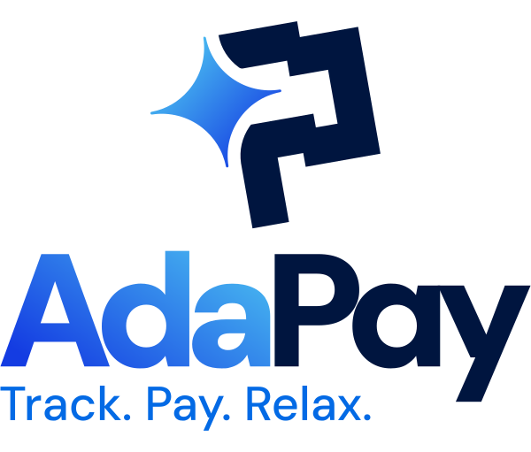

<div align="center">
  
  
  # ADA Pay
  
  **Track. Pay. Relax.**
  
  App personal de control de pagos y recordatorios financieros.
  
  
  
  
</div>

---

## ¿Qué es ADA Pay?

ADA Pay es una PWA (Progressive Web App) de control financiero personal. Te ayuda a:

- **Registrar** todos tus compromisos de pago
- **Organizar** los pagos por tu periodo de cobro (semanal, quincenal o mensual)
- **Recordar** qué tienes que pagar antes de que llegue tu próximo día de cobro
- **Historial** de pagos con métricas mensuales

---

## Características

### 💳 Tipos de pago
- **Pago único** — un solo pago en una fecha específica
- **Recurrente** — se repite automáticamente (semanal, quincenal, mensual, bimestral, trimestral, semestral o anual)
- **Parcialidades** — N pagos del mismo compromiso, con fecha de inicio real (puede ser pasada)
- **Variable** — el monto cambia cada periodo

### 📅 Periodo de cobro inteligente
La app organiza tus pagos según tu día de cobro. Si te pagan cada viernes, te muestra qué tienes que cubrir **antes del próximo viernes**, separando claramente los vencidos, los urgentes y los próximos.

### 🔔 Notificaciones push
- Alerta de pagos vencidos
- Recordatorio de pagos que vencen hoy
- Aviso anticipado (configurable: 1, 2, 3, 5 o 7 días antes)
- Resumen del día de cobro
- Hora de notificación configurable

### 📊 Historial
- Gráfica de gasto mensual (últimos 3, 6 o 12 meses)
- Filtro por nombre de pago
- Total y promedio mensual

---

## Stack

| | Tecnología |
|---|---|
| **Frontend** | React 18 + Vite 5 |
| **Base de datos** | Supabase (PostgreSQL) |
| **Autenticación** | Supabase Auth (Email + Google OAuth) |
| **Storage** | Supabase Storage (avatares) |
| **Deploy** | Vercel |
| **Push notifications** | Web Push API + VAPID |
| **PWA** | Service Worker + Web App Manifest |

---

## Setup local

### Requisitos
- Node.js 18+
- Cuenta en Supabase
- Cuenta en Vercel (para deploy)

### Instalación

```bash
git clone https://github.com/JohnDguez/ADA-App.git
cd ADA-App
npm install
```

### Variables de entorno

Crea un archivo `.env` en la raíz:

```env
VITE_SUPABASE_URL=https://tu-proyecto.supabase.co
VITE_SUPABASE_ANON_KEY=tu-anon-key
VITE_VAPID_PUBLIC_KEY=tu-vapid-public-key
```

### Supabase

Corre las siguientes migraciones en el SQL Editor de Supabase:

```sql
-- Tabla de perfiles (se crea automáticamente via trigger)
-- Ver CONTEXT.md para el schema completo

-- Código de acceso inicial
INSERT INTO access_codes (code, active) VALUES ('ADA2024', true);
```

### Correr en local

```bash
npm run dev
```

---

## Deploy

El proyecto se despliega automáticamente en Vercel cuando se hace push a `main`.

### Variables de entorno en Vercel

Además de las variables de frontend, agregar:

```
VAPID_PRIVATE_KEY=...
VAPID_EMAIL=mailto:tu@email.com
SUPABASE_SERVICE_ROLE_KEY=...
CRON_SECRET=tu-secret-para-el-cron
```

---

## Estructura del proyecto

```
ADA-App/
├── public/          # Assets estáticos, SW, manifest
├── api/             # Vercel serverless functions
└── src/
    ├── components/  # Componentes reutilizables
    ├── hooks/       # Custom hooks (auth, payments, profile, etc.)
    ├── lib/         # Supabase client + utilidades
    └── pages/       # Páginas de la app
```

> Ver `CONTEXT.md` para documentación técnica detallada.

---

## Licencia

Proyecto privado — todos los derechos reservados.

---

<div align="center">
  Hecho con ☕ en Culiacán, Sinaloa
</div>
